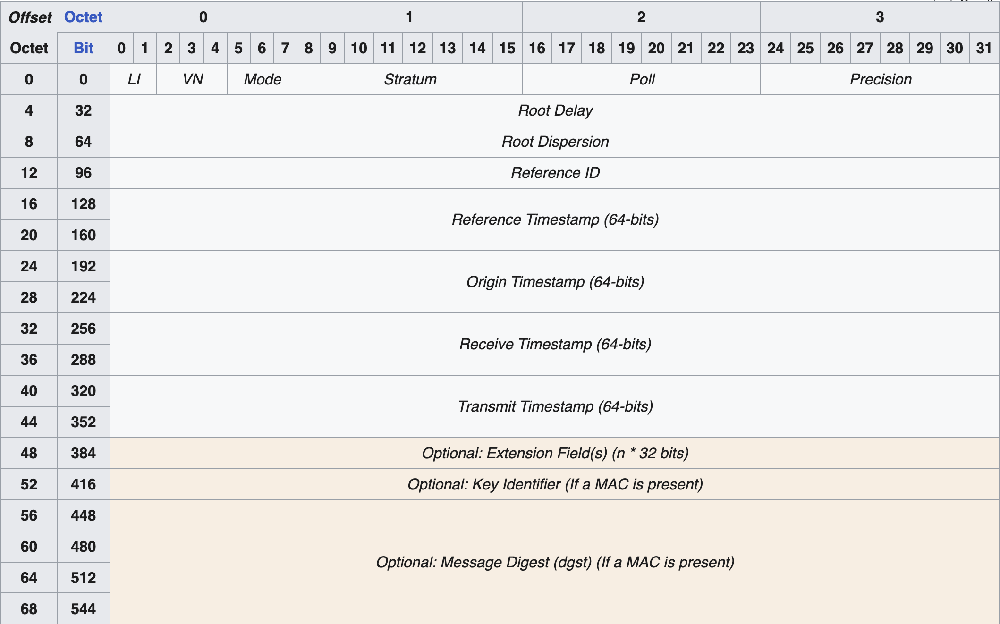

# Theory and Concepts

This section explains the foundational concepts behind goMESA's design, helping you understand why NTP makes an effective covert channel and how packet capture enables stealthy operation.

## NTP as a Covert Channel

### Why NTP Works

NTP has several characteristics that make it attractive for covert communications:

1. **Ubiquity & Necessity**: NTP is fundamental to nearly all networked systems. It's required for logging, security mechanisms (Kerberos), distributed systems coordination, and financial transactions.

2. **Firewall Allowance**: Due to its necessity, NTP traffic (UDP port 123) is almost universally permitted through firewalls without restriction.

3. **Limited Inspection**: Unlike HTTP/S or DNS, NTP traffic is rarely subjected to deep packet inspection. Security appliances typically allow it through unexamined.

4. **UDP Protocol**: Being connectionless, NTP doesn't require session establishment overhead. Custom packets can be crafted and sent without complex handshaking.

5. **Regular Patterns**: Legitimate NTP clients communicate periodically (every 64-1024 seconds), so regular agent beaconing appears normal rather than suspicious.

6. **Bidirectional Nature**: The request-response pattern of NTP naturally accommodates two-way C2 communication.

### Legitimate Cover

A key aspect of goMESA's design is that the C2 server functions as a **real** NTP server. It correctly processes and responds to time requests from standard NTP clients. This dual functionality means:

- Network traffic analysis shows legitimate NTP service
- The server passes basic service verification
- C2 communications are hidden within valid protocol interactions

## Background on NTP

Understanding NTP's normal operation helps illustrate how goMESA exploits it.

### The Foundation of Internet Timekeeping

Developed by David Mills in 1985, NTP synchronizes clocks across computer networks. It uses a hierarchical system:

- **Stratum 0**: High-precision sources (atomic clocks, GPS receivers)
- **Stratum 1**: Servers synchronized directly to Stratum 0
- **Stratum 2-15**: Each level synchronized to the one above

Most devices sync to servers several strata removed from the reference sources.

### Protocol Characteristics

- **Transport**: UDP (connectionless)
- **Port**: 123
- **Packet Size**: 48 bytes (standard)

UDP's connectionless nature suits time synchronization where timeliness matters more than guaranteed delivery.

### Packet Structure

A standard NTP packet contains:

| Field | Size | Purpose |
|-------|------|---------|
| LI, VN, Mode | 1 byte | Leap indicator, version, client/server mode |
| Stratum | 1 byte | Distance from reference clock |
| Poll | 1 byte | Polling interval |
| Precision | 1 byte | Clock precision |
| Root Delay | 4 bytes | Round-trip delay to reference |
| Root Dispersion | 4 bytes | Dispersion to reference |
| Reference ID | 4 bytes | Identifier of reference source |
| Timestamps | 32 bytes | Four 64-bit timestamps |



### Operational Patterns

Clients poll servers periodically:

1. Initial polling is frequent (~64 seconds)
2. Interval increases as clock stabilizes (~1024 seconds)
3. Clock adjustments are gradual ("slewing") to avoid disruption

## Raw Network Access (libpcap/gopacket)

goMESA agents use raw network access for stealth, typically via libpcap or its Windows equivalent (Npcap).

### Why Packet Capture?

Standard applications use high-level socket APIs where the OS networking stack handles protocol processing. Packet capture libraries bypass this, providing:

- **Direct access** to the network interface data stream
- **Complete packets** including all headers
- **Passive observation** without binding ports

### How It Works

```
┌─────────────────────────────────────────────────────────────┐
│                      Application                             │
├─────────────────────────────────────────────────────────────┤
│  Standard Socket API          │    Packet Capture (libpcap) │
│  (sees only L7 payload)       │    (sees complete packets)  │
├───────────────────────────────┴─────────────────────────────┤
│                    Operating System                          │
│              Network Stack (L2-L4 processing)                │
├─────────────────────────────────────────────────────────────┤
│                   Network Interface                          │
└─────────────────────────────────────────────────────────────┘
```

### Kernel-Level Filtering

libpcap uses BPF (Berkeley Packet Filter) for efficient filtering:

```
udp and port 123 and host 192.168.1.100
```

This filter runs in the kernel, so only matching packets are copied to user space, minimizing overhead.

### Benefits for goMESA

| Benefit | Explanation |
|---------|-------------|
| **Coexistence** | Monitors traffic without binding port 123 |
| **Precise Filtering** | Captures only packets from C2 server |
| **Full Header Access** | Can inspect all protocol layers |
| **Stealth** | Operates alongside legitimate NTP client |

### Why Not Standard Sockets?

Using regular UDP sockets for goMESA would be problematic:

1. **Port Conflict**: Binding to UDP 123 conflicts with the system's NTP service
2. **Indiscriminate Reception**: Would receive all NTP traffic, requiring expensive user-space filtering
3. **Interference**: Would likely disrupt normal time synchronization
4. **Limited Access**: Header information might be inaccessible

### Requirements

Packet capture requires elevated privileges:

| Platform | Requirement |
|----------|-------------|
| Linux | `libpcap-dev` package, root privileges |
| Windows | Npcap installed, administrator privileges |
| macOS | libpcap (usually pre-installed), root privileges |

---

Next: [Architecture](03-architecture.md)
